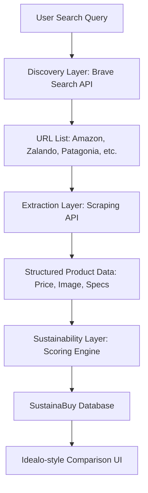

# SustainaBuy Phase 2: Building the "Sustainable Idealo" Clone

To build a true Idealo clone—a price comparison and discovery engine—you need to "index" products at scale. Since indexing the entire internet is a billion-dollar task, we will use a **Smart Aggregation Strategy** to achieve the same result with zero cost and minimal setup.

---

## 1. The "Pseudo-Index" Architecture
Instead of crawling the web from scratch, we use existing search indices as our "Discovery Layer" and then "Enrich" that data with sustainability metrics.



---

## 2. Component Breakdown

### A. Discovery (Finding the Products)
To find where products are sold without building a crawler:
- **Tool:** [Brave Search API](https://brave.com/search/api/)
- **Why:** It offers a massive, independent web index with a generous **Free Tier (2,000 queries/month)**. 
- **Setup:** Get an API key and query it for "sustainable [category] products" to get a list of retail URLs.

### B. Extraction (Getting the Details)
Once you have a URL, you need to "scrape" the price and images.
- **Tool:** [ScrapingBee](https://www.scrapingbee.com/) or [Apify](https://apify.com/)
- **Why:** They handle proxies, rotating IPs, and Javascript rendering (so you don't get blocked).
- **Free Strategy:** Most offer 1,000 free credits upon signup.

### C. The Scorer (The "Secret Sauce")
Idealo only shows prices. **SustainaBuy** shows "Sustain-Ability".
- **Logic:** Use the **Open Food Facts API** for groceries or an **LLM (like GPT-4o-mini)** to analyze the product description and give it a score (1-100) based on materials, labor claims, and certifications.

---

## 3. How to Build it (Technical Stack)
To run this at scale for "free", use a **Serverless Workflow**:
1. **Frontend:** Next.js (hosted on Vercel - Free).
2. **Database:** Supabase (PostgreSQL - Free Tier).
3. **Task Runner:** GitHub Actions (to run your "indexer" script every night for free).

---

## 4. Fixing Your Environment: Installing Node.js
I noticed `npm` and `node` are missing from your system. You need these to build the "Idealo" clone.

### Installation Steps (Mac):
1. **Install Homebrew** (if you don't have it):
   ```bash
   /bin/bash -c "$(curl -fsSL https://raw.githubusercontent.com/Homebrew/install/HEAD/install.sh)"
   ```
2. **Install Node.js:**
   ```bash
   brew install node
   ```
3. **Verify:**
   ```bash
   node -v
   npm -v
   ```

---

## 5. Implementation Roadmap: "The Indexer" Script
Here is a conceptual script you can run (once Node is installed) to "Index the internet" for a specific product:

```javascript
// conceptual_indexer.js
const axios = require('axios');

async function indexProduct(productName) {
  // 1. Discover URLs via Brave Search
  const searchResults = await axios.get(`https://api.search.brave.com/res/v1/web/search?q=${productName}`, {
    headers: { 'X-Subscription-Token': 'YOUR_KEY' }
  });

  // 2. Loop through URLs and extract data (Concept)
  for (let result of searchResults.data.web.results) {
    console.log(`Found product at: ${result.url}`);
    // Use ScrapingBee here to get price/image
  }
}
```

> [!IMPORTANT]
> To truly be an "Idealo clone", you need **Product Normalization**. This means identifying that a "Patagonia Torrentshell" on Amazon is the same as the one on REI. Use the **GTIN (Barcode)** from the Open Food/Beauty Facts APIs to link these items together.
